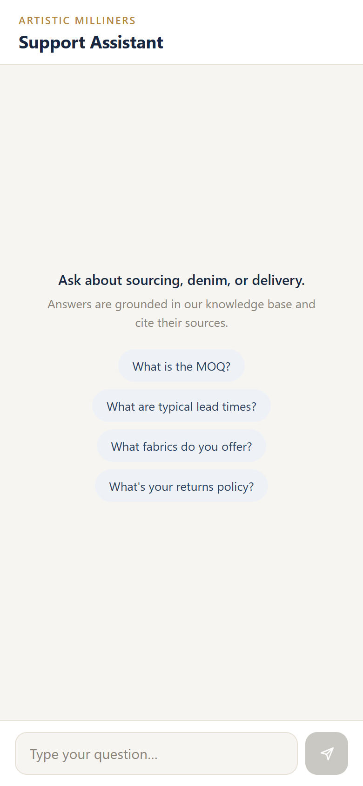
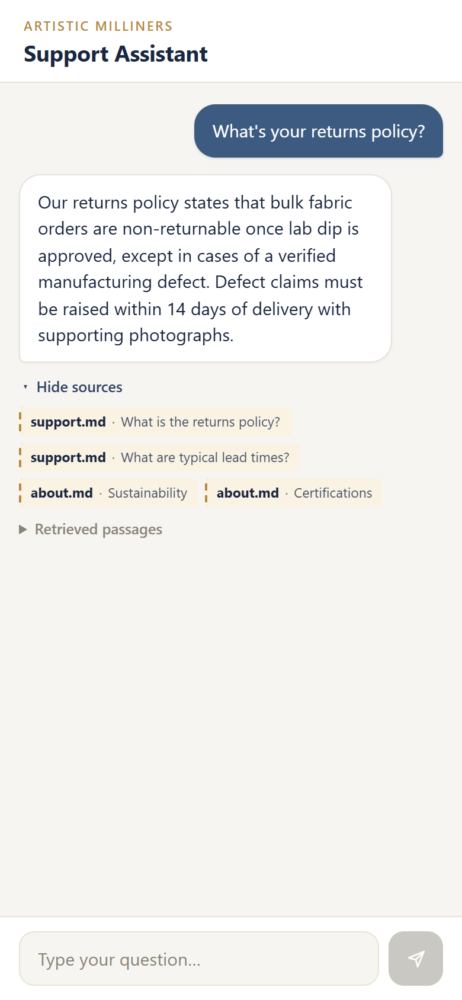

# Artistic Milliners — Support RAG Chatbot

A retrieval-augmented (RAG) support assistant that answers questions **only** from a fixed
knowledge base, cites its sources, and remembers the conversation. Runs **fully local at
$0** — no paid APIs.

> Built specifically in response to the Artistic Milliners "Chatbot / AI Conversation
> Engineer" job posting. The knowledge base is a small mock of AM's own support/product/
> policy content, so the demo speaks to their actual business (denim manufacturing, MOQs,
> lead times, returns) rather than a generic tutorial corpus.

---

## What it does

- **Grounded answers**: retrieves the most relevant passages from the corpus and asks a
  local LLM to answer using only that context.
- **Anti-hallucination**: if the answer isn't in the corpus, it says *"I don't know"* and
  points you to the sales team (verified in the eval — the "Who is the CEO?" question).
- **Cited sources**: every answer shows which document/section it came from, plus the raw
  retrieved passages (a "show your work" panel that proves retrieval, not just generation).
- **Multi-turn memory**: follow-up questions retain conversation context.
- **Mobile-first, polished UI**: a clean chat interface that works at phone width and up.

## Architecture

```
 React (Vite) UI  ──HTTP──►  FastAPI backend
                                  │
                ┌─────────────────┼──────────────────┐
                ▼                 ▼                  ▼
        MiniLM embeddings   Chroma vector store   Ollama (llama3.2:3b)
        (ONNX, CPU)         (top-k retrieval)     (local generation)
```

Query → embed → top-k retrieve from Chroma → build prompt (system + retrieved context +
session history) → local LLM → answer + cited sources + retrieved chunks. Full design in
[docs/design.md](docs/design.md).

## Tech stack

| Layer | Choice |
|---|---|
| Backend | FastAPI (Python 3.12) |
| Vector DB | Chroma (local, persistent) |
| Embeddings | ChromaDB built-in ONNX all-MiniLM-L6-v2 (CPU, no torch) |
| LLM | Ollama `llama3.2:3b` (local) |
| Frontend | React 19 + Vite, plain CSS |

### What's mine vs. library

- **Written for this project**: the markdown chunker, the RAG pipeline + anti-hallucination
  prompt, the source-citation/dedup logic, the Chroma wrapper, the FastAPI endpoints, the
  entire React UI, and the evaluation harness.
- **Off-the-shelf**: Chroma (storage + similarity search), the MiniLM ONNX embedding model,
  the Ollama runtime + Llama 3.2 weights, FastAPI, React/Vite.

## Honest evaluation

A fixed 6-question eval plus a dedicated multi-turn check (`backend/eval/`) runs live
against the API. Current result on this machine with `llama3.2:3b`:

**7 / 7 passed** — 5 in-corpus factual questions answered correctly with the right cited
source, 1 out-of-corpus question (the CEO) correctly answered *"I don't know"* instead of
hallucinating, and 1 multi-turn check proving conversation history is actually used: within
one session, "Do you offer stretch denim?" followed by the pronoun-only follow-up "What fits
is it suited for?" resolves "it" to stretch denim via history and correctly answers
"skinny and jegging fits".

Honesty notes:
- The eval matcher normalizes number formatting (`1,000` == `1000`) and accepts several
  correct phrasings per question — because a small local LLM paraphrases. It tests whether
  the **fact** is present, not an exact string. The model's answers were correct before this
  change; the fix was to the test's brittleness, not the bot.
- Each single-turn eval question runs in its own isolated session so unrelated questions
  never leak history into each other; the multi-turn check uses a separate shared session
  specifically to prove history *does* carry over when it should.
- The refusal check requires an explicit "don't know" / "not sure" phrase — not the word
  "contact" — since the corpus has a "contact the sales team" section that could otherwise
  let a hallucinated answer pass.
- This is a small, hand-written corpus and a 7-check eval — a demonstration of the RAG
  pipeline and its evaluation discipline, not a benchmark claim.

## Running it locally

Prerequisites: Python 3.12, Node.js, and [Ollama](https://ollama.com).

**1. Model**
```bash
ollama pull llama3.2:3b
```

**2. Backend**
```bash
cd backend
python -m venv .venv
.venv\Scripts\pip install -r requirements.txt        # Windows
# (macOS/Linux: python -m venv .venv && source .venv/bin/activate && pip install -r requirements.txt)
uvicorn main:app --port 8000
```
Then ingest the corpus (one time):
```bash
curl -X POST http://127.0.0.1:8000/ingest
```

**3. Frontend**
```bash
cd frontend
npm install
npm run dev            # http://localhost:5173
```

**4. Evaluate (optional)**
```bash
cd backend
.venv\Scripts\python eval/run_eval.py
```

## Performance note (local, honest)

This runs on CPU (no dedicated GPU) with a deliberately small 3B model to fit modest RAM.
Answers take a few seconds each — the tradeoff for zero cost and full local privacy. The
architecture is model-agnostic: point it at a larger local model (or a hosted one) by
changing `LLM_MODEL` and answers improve with no code changes.

## Screenshots

Mobile-first chat with grounded answers and expandable source citations.

| Empty state | Grounded answer with cited sources |
|---|---|
|  |  |

## Stretch goals (not in v1)

- WhatsApp / Telegram integration (matches the posting's "Plus" skills)
- Cloud deployment (Render/Railway backend, Vercel frontend)
- Installable PWA with offline app-shell
- Tool-calling (e.g. mock "ticket status" lookup)
